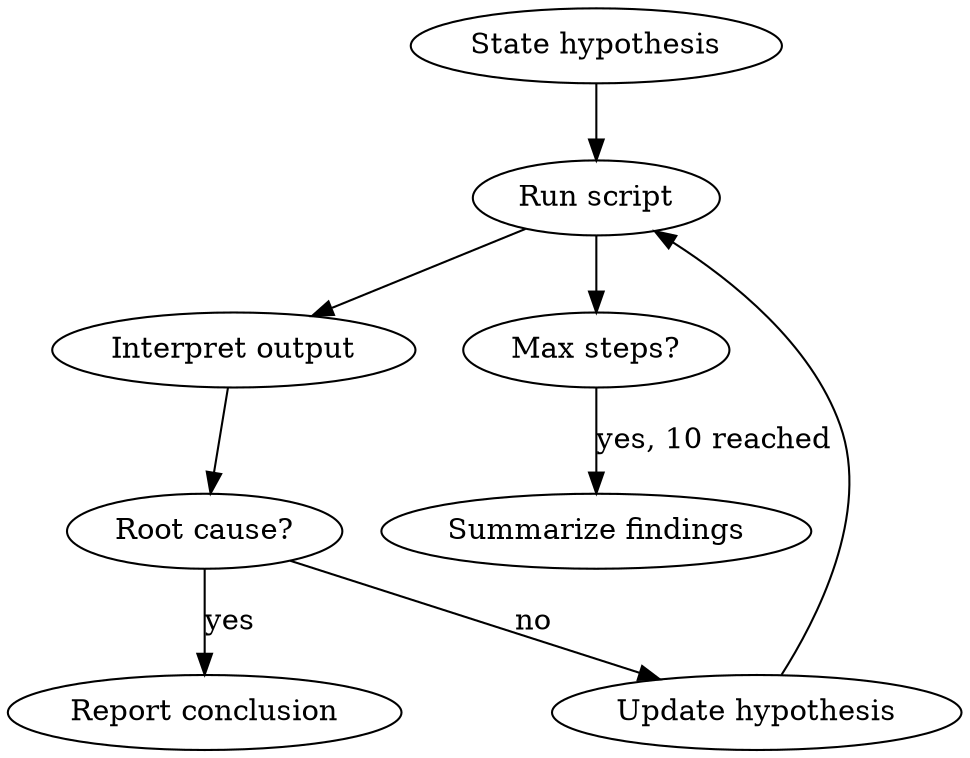

# Baremetal Troubleshooting

Systematic investigation of baremetal system issues using boxctl's 216 monitoring scripts.

## When to Use

User invokes `/baremetal` after discovery has identified relevant scripts.

## Investigation Loop



## Step Tracking

Track explicitly in each message:

```
## Investigation: <original symptom>

**Step N/10**: Running <script>
**Hypothesis**: <current theory>
**Finding**: <what this script revealed>
**Next**: <why running next script>
```

## Running Scripts

```bash
# Non-privileged
boxctl run <script> --format json

# Root required (check boxctl show first)
boxctl --sudo run <script> --format json
```

Prefer `--format json` for structured parsing. Fall back to plain text if JSON unavailable.

## Guardrails

| Rule | Action |
|------|--------|
| Max 10 steps | Summarize findings, ask if user wants more |
| Exit code 2 | Run `boxctl doctor`, report missing tool |
| Permission denied | Suggest non-privileged alternatives |
| Root cause found | Stop, report conclusion with evidence |

## Fast Paths

Skip deep investigation for obvious patterns:

| Pattern | Diagnosis |
|---------|-----------|
| Exit 1 + "disk full" in output | Disk space exhaustion |
| Exit 1 + "OOM" events | Memory exhaustion |
| Exit 2 + tool missing | Missing dependency |

## Privilege Verification

Before using `--sudo`:
1. Run `boxctl show <script>` to confirm privilege requirement
2. Script must be from boxctl distribution (not user-added)
3. If denied, explain what info would have been gained

## Common Mistakes

| Mistake | Fix |
|---------|-----|
| Running without hypothesis | State what you expect to find |
| Ignoring exit codes | 0=healthy, 1=issues, 2=error |
| Too many scripts at once | One at a time, interpret before next |
| No step count | Always show "Step N/10" |
