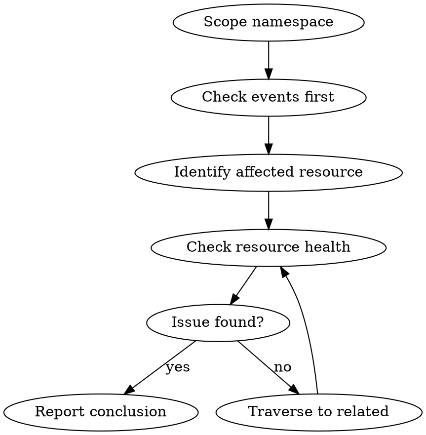

# K8s Troubleshooting

Graph-based investigation of Kubernetes issues using boxctl's 93 k8s monitoring scripts.

## When to Use

User invokes `/k8s` after discovery has identified relevant scripts.

## Key Difference from Baremetal

Baremetal = vertical (OS stack). K8s = horizontal (resource graph).

```
Pod → Deployment → Service → Ingress
 ↓         ↓           ↓
Events   ReplicaSet  Endpoints
```

Traverse the graph based on symptoms.

## Investigation Pattern



## Step Tracking

```
## Investigation: <symptom> in namespace <ns>

**Step N/10**: Checking <resource type>
**Graph position**: <current resource> → <traversing to>
**Finding**: <what this revealed>
**Next**: <upstream/downstream because...>
```

## Running Scripts

```bash
# Always specify namespace
boxctl run <script> -n <namespace> --format json

# Cluster-wide (careful)
boxctl run <script> --format json
```

No sudo needed - kubectl handles auth.

## Event-First Strategy

Always check events early - they're the fastest diagnostic:

```bash
boxctl run event_monitor -n <namespace> --format json
```

Events expire after ~1 hour. Note if investigating older issues.

## Graph Traversal Rules

| Starting Point | Traverse Upstream | Traverse Downstream |
|----------------|-------------------|---------------------|
| Pod issues | → Deployment → ReplicaSet | → Container logs |
| Service issues | → Endpoints → Pods | → Ingress |
| Deployment issues | → HPA, PDB | → ReplicaSet → Pods |
| Node issues | → Taints, conditions | → Pods on node |

## Namespace Scoping

1. **Default**: Always scope to a single namespace
2. **Cross-namespace**: Only with explicit user confirmation
3. **Cluster-wide**: Only for node/cluster-level resources

## Guardrails

Same as baremetal:
- Max 10 steps before summary
- Exit code handling (0=healthy, 1=issues, 2=error)
- Track hypothesis at each step

## Common K8s Patterns

| Symptom | First Check | Likely Cause |
|---------|-------------|--------------|
| CrashLoopBackOff | event_monitor, pod_health | OOMKilled, config error, dependency |
| Pending pods | node_health, resource_usage | Insufficient resources, taints |
| Service unreachable | service_health, endpoint_health | Selector mismatch, no ready pods |
| Slow response | api_latency, resource_usage | CPU throttling, overloaded nodes |

## Dead Ends

When you can't find a script for what you need:

1. Confirm no existing script covers it: `boxctl search "your terms"`
2. File a request:
   ```bash
   boxctl request "capability needed" \
     --searched "terms you tried" \
     --context "what you were investigating"
   ```
3. Document the gap in your investigation summary
4. Continue with alternative approaches if possible
